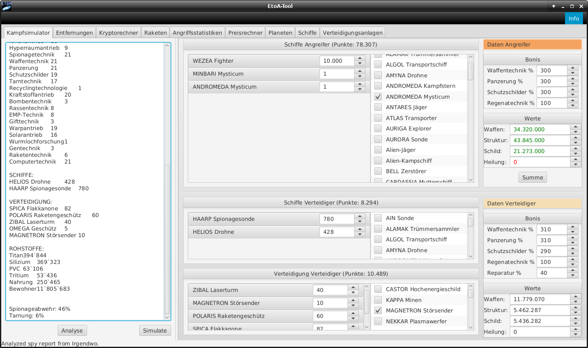
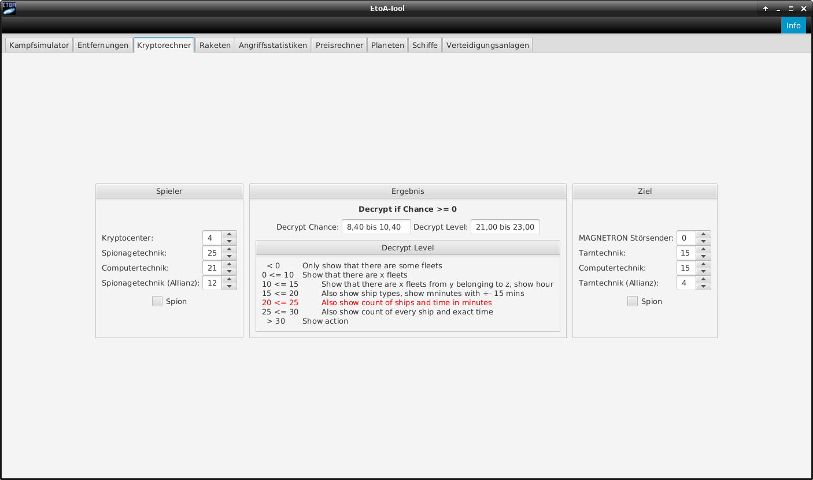
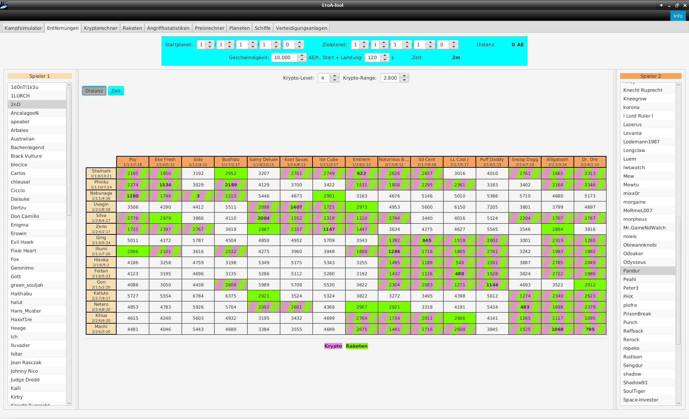
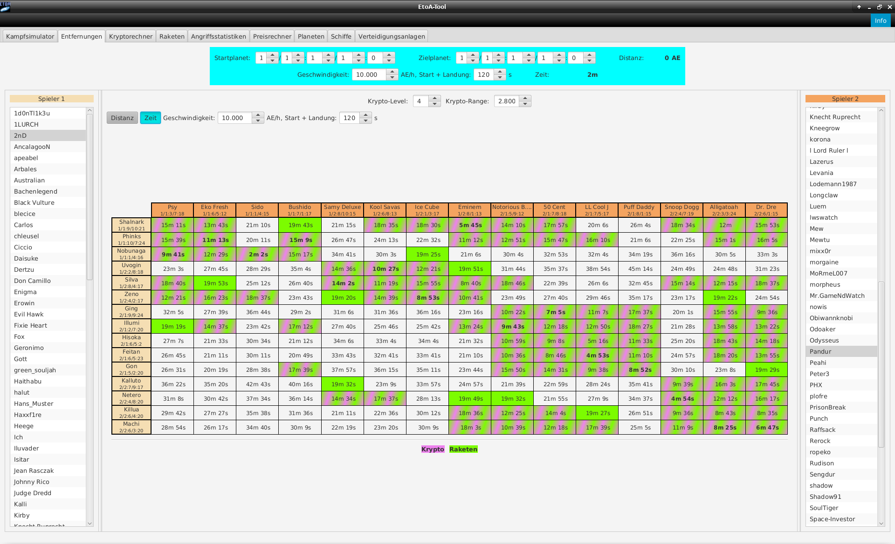
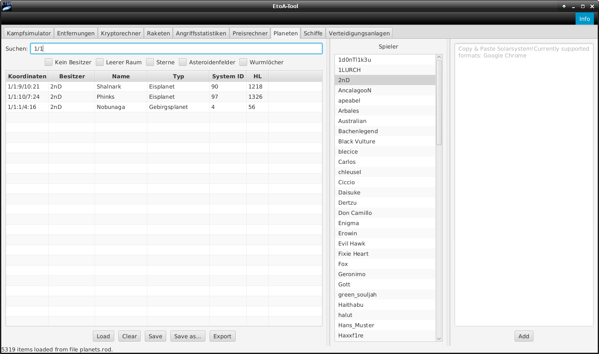

# Tool for Escape to Andromeda

- [Current features](#currentfeatures)
- [Beginner's Guide to compile your own KB-Sim](#build)

## Current features
### Kampfsimulator

### Krypto-Rechner

### Distanzen und Flugzeiten

### Planetenübersicht

## Beginner's Guide to compile your own KB-Sim (by misThor_bean)
**:warning: The Beginner's Guide is OUTDATED! :warning:**

### Voraussetzungen/Requirements
- Java SDK       ###  Download: http://enos.itcollege.ee/~jpoial/allalaadimised/jdk8/jdk-8u241-windows-x64.exe
- Apache ANT     ###  Download: https://downloads.apache.org//ant/binaries/apache-ant-1.10.7-bin.zip
- Inno Setup     ###  Download: https://jrsoftware.org/download.php/is.exe

### Installation Java
Programm normal installieren. Keine zusätzlichen Einstellungen nötig.
Nach der Installation die Umgebungsvariablen anpassen.
unter Win10: Klickt auf Start (Windows-Taste) / Schreibt "Systemumgebungsvariabeln" / klickt auf Systemumgebungsvariabeln bearbeiten / es öffnet sich das Fenster "Systemeigenschaften" / 
klickt auf "Umgebungsvariabeln" ganz unten / bei Systemvariabeln klickt ihr auf "Neu..." / Name der Variablen: JAVA_HOME / Wert der Variablen: C:\Program Files\Java\jdk1.8.0_241 
(bzw. Pfad wo ihr Java installiert habt) / mit OK bestätigen

Zum verifizieren: öffnet ein Konsolenfenster (Win-Taste + R -> cmd eingeben) und gebt "java -version" ein / daraufhin sollten 3 Zeilen mit Informationen zu eurem Java erscheinen, falls nicht, wurde bei der
Variablen ein Fehler gemacht -> Name und Pfad überprüfen

### Installation Apache ANT
Apache ANT muss nicht installiert werden. Ihr entpackt einfach den Ordner "apache-ant-1.10.7" an einen beliebigen Ort und passt danach wieder die Umgebungsvariablen an:
Systemvariable neu = ANT_HOME (Pfad zu Ordner "apache-ant-1.10.7")
Systemvariable "Path" suchen / Bearbeiten / Neu / "%ANT_Home%\bin" hinzufügen

Zum verifizieren: öffnet ein Konsolenfenster (Win-Taste + R -> cmd eingeben) und gebt "ant -version" ein / daraufhin sollte eine Zeilen mit Informationen zu eurem Apache Ant(TM) erscheinen, falls nicht, wurde bei der Variablen ein Fehler gemacht -> Name und Pfad überprüfen

### Installation Inno Setup
Bei der Installation "Installation für alle Benutzer" auswählen / ansonsten alles auf Standard belassen

### EtoA-Tool erstellen
Öffnet ein Konsolenfenster (Win-Taste + R -> cmd eingeben) und navigiert zu eurem "EtoA-Tool-master" -> da sollte dann so etwas stehen wie "C:\Users\dein Username\Downloads\EtoA-Tool-master>"
Anschliessend den Befehl: "ant -f build_exe.xml" eingeben -> das EXE-File wird nun erstellt und im Pfad EtoA-Tool-master\build\deploy\bundles gespeichert -> Doppelklick auf die EXE installiert den EtoA-KB-Sim

Das wars, viel Spass!